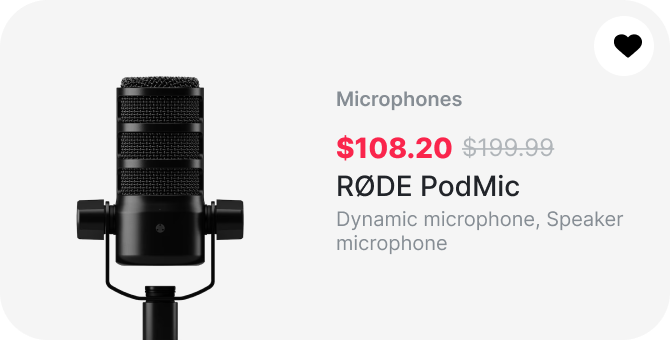

# ⚠️ DealCard — Needs Visual Review

**Match score:** 63.43459174714662/100  
**Method:** pixel  
**Measurement:** measured  
**Pixel exact:** no  
**Exact mismatch:** 36.56540825285338%  
**Perceptual mismatch:** 0.5280948200175593%  
**Dimensions:** 670×340 vs 670×340 (match)  
**Hotspot coverage:** 100% (complete)  
**Generated by:** Guing AI (pixel-perfect loop)

## Visual differences reported

- Hotspot at (0,0) 332×340px: 66.6% exact mismatch
- Hotspot at (0,0) 576×340px: 42.0% exact mismatch
- Hotspot at (324,70) 346×242px: 9.2% exact mismatch
- Hotspot at (324,0) 346×270px: 8.6% exact mismatch
- Hotspot at (324,70) 346×270px: 8.3% exact mismatch

## Figma reference

The exact Figma node structure is saved in `DealCard.figma.json`.
